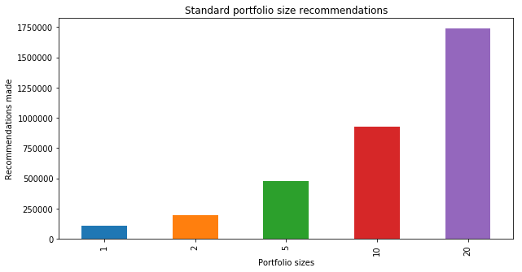
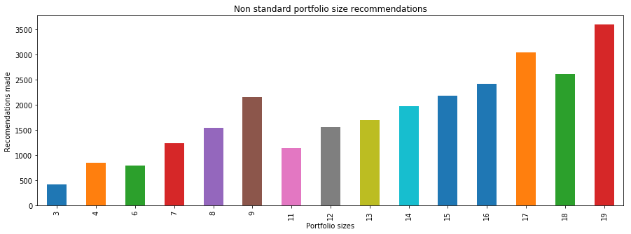
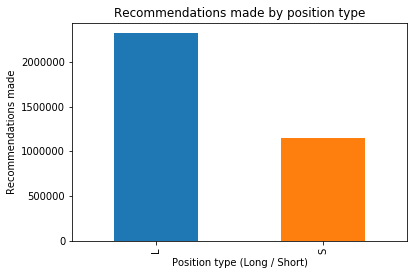
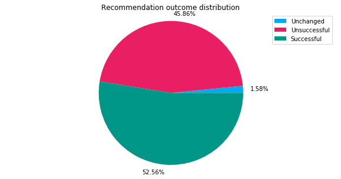
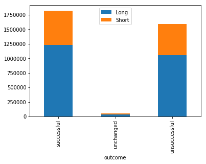
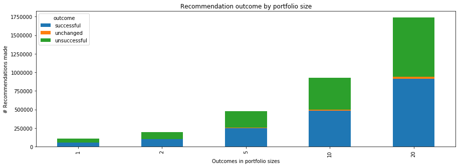
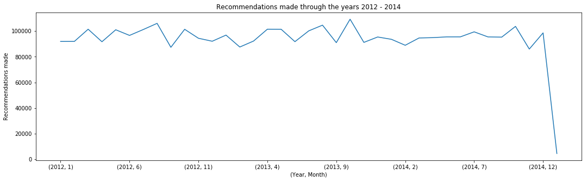
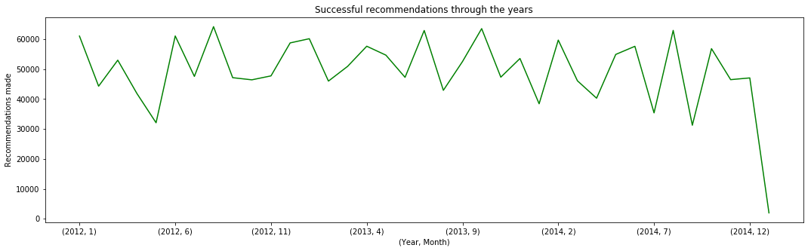

# Análisis de datos sobre recomendaciones de portafolios por ZZAlpha Ltd

_Preparado por Julio César Gutiérrez Muñoz_.

Fuente de datos: [UCI Machine Learning Repository - ZZAlpha Ltd. Stock Recommendations 2012-2014](https://archive.ics.uci.edu/ml/datasets/Machine+Learning+based+ZZAlpha+Ltd.+Stock+Recommendations+2012-2014)

Las librerías necesarias para la correcta ejecución de este notebook son:

- Pandas
- Matplotlib
- PySpark
- Pymongo

## Estructura de los datos

El dataset se compone de tres carpetas las cuales contienen 250, 252 y 253 archivos respectivamente:


```python
!tree -L 2 --filelimit 3 portfolio-recommendations
```

    portfolio-recommendations
    ├── sNewsListWResults2012 [250 entries exceeds filelimit, not opening dir]
    ├── sNewsListWResults2013 [252 entries exceeds filelimit, not opening dir]
    └── sNewsListWResults2014 [253 entries exceeds filelimit, not opening dir]
    
    3 directories, 0 files


El número de lineas contenidas en cada archivo varía así como su estructura, en total el dataset contiene 482,016 portafolios con recomendaciónes de inversión realizadas por ZZAlpha Ltd entre el 2011 y el 2014:


```python
!find portfolio-recommendations/ -name '*.txt' -type f | xargs wc -l | grep total | xargs echo "No. lines:"
```

    No. lines: 482016 total


Dichas recomendaciones están organizadas en portafolios de diferentes tamaños (entre 1 y 20 stocks c/u), cuando estas recomendaciones se toman en cuenta individualmente se observa que se realizaron un total de 3,467,030 de operaciones en el periodo mencionado.

Cada linea tiene una estructura similar a la siguiente:

```
Jan 04 2005_006 Big_100_5_LONG_SHORT_F.pdf, L, AA 0.959 =25.97/27.09, AMAT 0.950 =14.70/15.46, EBAY 0.930=53.33/57.31, PFE 0.995 =19.84/19.95, UPS 0.980 =71.72/73.16, Avg of 5 = 0.963
```

> The above indicates recommendations were made before market open on **Jan 4, 2005**. This portfolio was limited to the biggest **100 cap stocks** and was of **size 5**. It was for **'L'** or long recommendations. The **five stocks recommended are shown by ticker, result, price at sale divided by price at purchase**. The **average for the five is shown**.

Se define la función mapper que transforma cada linea en una estructura más ordenada que puede ser exportada a CSV fácilmente.

#### Sample Input

```
'Jul 09 2012_140 Cap_1-5B_20_LONG_F.pdf, L, AGP 1.000 =missing,AIZ 0.987 =34.40/34.86,BPOP 1.007 =16.21/16.10,CCO 0.830 =4.75/5.72,CNC 1.104 =35.71/32.36,DWA 1.001 =19.32/19.31,GEF 1.014 =41.88/41.30,HGSI 1.046 =14.22/13.59,HNT 1.018 =26.30/25.83,IOC 1.064 =74.44/69.94,JEF 0.997 =12.67/12.71,JNS 0.959 =7.23/7.54,KCG 0.994 =11.77/11.84,MAKO 1.000 =missing,OPEN 0.995 =38.74/38.94,PL 0.986 =29.61/30.03,SFG 0.990 =37.31/37.70,SINA 0.969 =49.04/50.60,STSA 0.996 =19.29/19.37,TRGP 1.058 =44.74/42.27, Avg of 18 = 1.001'
```

#### Sample Output

```
('2012-07-09 00:00:00', 'Cap_1-5B_20_LONG_F', 'L', '1.001', 'AGP:1.000:*:*', 'AIZ:0.987:34.40:34.86', 'BPOP:1.007:16.21:16.10', 'CCO:0.830:4.75:5.72', 'CNC:1.104:35.71:32.36', 'DWA:1.001:19.32:19.31', 'GEF:1.014:41.88:41.30', 'HGSI:1.046:14.22:13.59', 'HNT:1.018:26.30:25.83', 'IOC:1.064:74.44:69.94', 'JEF:0.997:12.67:12.71', 'JNS:0.959:7.23:7.54', 'KCG:0.994:11.77:11.84', 'MAKO:1.000:*:*', 'OPEN:0.995:38.74:38.94', 'PL:0.986:29.61:30.03', 'SFG:0.990:37.31:37.70', 'SINA:0.969:49.04:50.60', 'STSA:0.996:19.29:19.37', 'TRGP:1.058:44.74:42.27')
```


```python
import csv
import pandas as pd
import numpy as np
import matplotlib.pyplot as plt
from pyspark import SparkContext
from dateutil import parser
from pymongo import MongoClient
```


```python
SparkContext.setSystemProperty('spark.executor.memory', '2g')
sc = SparkContext.getOrCreate()

dataset = sc.textFile('portfolio-recommendations/*/*.txt')
```


```python
sc._conf.getAll()
```


    [('spark.app.id', 'local-1512587159235'),
     ('spark.executor.memory', '2g'),
     ('spark.rdd.compress', 'True'),
     ('spark.driver.host', '10.13.8.32'),
     ('spark.serializer.objectStreamReset', '100'),
     ('spark.master', 'local[*]'),
     ('spark.executor.id', 'driver'),
     ('spark.submit.deployMode', 'client'),
     ('spark.driver.port', '56474'),
     ('spark.app.name', 'pyspark-shell')]


```python
def transform(line):
    data = list(map(str.strip, line.split(',')))
    
    if len(data) < 3:
        return 'missing'
    
    if 'Avg of 0' in data[-1]:
        return 'missing'
    
    report_info, operation, *stocks, avg = data
    
    # Extract date and name from report title
    report_date_code, report_name = report_info.rsplit(' ', 1)
    report_date = parser.parse(report_date_code.split('_')[0])
    
    # Extract average value
    average = avg.split('=')[1].strip()
    # average = average if average.isdigit() else '*'
    if not average.isdigit():
        print(average)
    
    # Format tickers (Remove '=', '/', ' ')
    stocks = [
        s.replace('=', '', 1).replace('/', ':', 1) \
        .replace(' ', ':').replace('missing', '*:*') \
        for s in stocks
    ]
    
    return '{rdate},{rname},{op},{avg},{stocks}'.format(
        rdate=str(report_date),
        rname=report_name[:-4],
        op=operation,
        avg=average,
        stocks=','.join(stocks))
```


```python
ds = dataset.map(transform)
ds.saveAsTextFile('alpha-recommendations')
```

Después de la transformación combinamos todos los diferentes archivos producidos por pyspark en uno solo `alpha-recommendations.csv` y eliminamos aquellos registros mal formados (_missing_):


```python
!cat alpha-recommendations/* | gsed '/missing/d' > alpha-recommendations.csv
!head -n5 alpha-recommendations.csv
```

    2012-03-27 00:00:00,Big_100_1_LONG_SHORT_F,L,1.007,PM:1.007:88.79:88.14
    2012-03-27 00:00:00,Big_100_1_LONG_SHORT_F,S,0.990,V:0.990:118.84:119.98
    2012-03-27 00:00:00,Big_100_2_LONG_SHORT_F,L,0.993,PM:1.007:88.79:88.14,VZ:0.979:37.95:38.76
    2012-03-27 00:00:00,Big_100_2_LONG_SHORT_F,S,0.994,V:0.990:118.84:119.98,WMT:0.997:61.14:61.35
    2012-03-27 00:00:00,Big_100_5_LONG_SHORT_F,L,0.994,APA:0.992:100.58:101.42,F:1.016:12.71:12.51,OXY:0.978:97.49:99.73,PM:1.007:88.79:88.14,VZ:0.979:37.95:38.76


## Almacenamiento de los datos

Para almacenar los datos de manera estructurada utilizamos MongoDB. A continuación se define el script que carga los datos de CSV a MongoDB:


```python
conn = MongoClient()
db = conn.alpha
```


```python
with open('alpha-recommendations.csv', 'r') as f:
    reader = csv.reader(f)

    for i, line in enumerate(reader):
        date, name, operation, average, *stocks = line
        size = len(stocks)
        
        recommendations = []
        for stock in stocks:
            ticker, roe, sold_at, bought_at = filter(None, stock.split(':'))

            recommendations.append({
                'ticker': ticker,
                'result': roe,
                'price_at_sale': sold_at,
                'price_at_purchase': bought_at
            })
            
        db.recommendations.insert_one({
            'date': date,
            'portfolio': name,
            'rid': i,
            'position': operation,
            'avg_result': average,
            'recommendations': size,
            'stocks': recommendations
        })
```

## Consultas y Agregaciones


```python
def printer(res):
    for r in res:
        print(r)
```

### ¿Cuántos portafolios diferentes se recomendaron?


```python
result = db.recommendations.aggregate([
    { '$group': { '_id': '$portfolio' } },
    { '$count': 'Unique portfolios' }
])

printer(result)
```

    {'Unique portfolios': 438}


### ¿De cuantos stocks se componen los diferentes portafolios que se recomendaron?


```python
result = db.recommendations.aggregate([
    { '$group': { '_id': '$recommendations' } },
    { '$sort': { '_id': -1 } }
])

printer(result)
```

    {'_id': 20}
    {'_id': 19}
    {'_id': 18}
    {'_id': 17}
    {'_id': 16}
    {'_id': 15}
    {'_id': 14}
    {'_id': 13}
    {'_id': 12}
    {'_id': 11}
    {'_id': 10}
    {'_id': 9}
    {'_id': 8}
    {'_id': 7}
    {'_id': 6}
    {'_id': 5}
    {'_id': 4}
    {'_id': 3}
    {'_id': 2}
    {'_id': 1}


### ¿Cuántas posiciones Long se recomendaron? ¿Cuántas fueron Short?


```python
result = db.recommendations.aggregate([
    { '$match': { 'position': 'L' } },
    { '$count': 'Long positions' }
])

printer(result)
```

    {'Long positions': 320840}


```python
result = db.recommendations.aggregate([
    { '$match': { 'position': 'S' } },
    { '$count': 'Short positions' }
])

printer(result)
```

    {'Short positions': 160421}


### ¿Cuántas recomendaciones fueron exitosas? ¿Cuántas fueron equivocadas?


```python
result = db.recommendations.aggregate([
    { '$match': { 'avg_result': { '$gt': '1' } } },
    { '$count': 'Successful recommendations' }
])

printer(result)
```

    {'Successful recommendations': 266357}


```python
result = db.recommendations.aggregate([
    { '$match': { 'avg_result': { '$lt': '1' } } },
    { '$count': 'Wrong recommendations' }
])

printer(result)
```

    {'Wrong recommendations': 214904}


### ¿Cuál fue la recomendación con el mejor resultado? ¿Cuál con el peor resultado?


```python
result = db.recommendations.aggregate([
    { '$sort': { 'avg_result': -1 } },
    { '$limit': 1 }
])

printer(result)
```

    {'_id': ObjectId('5a2ac400a4ce83963e470bd9'), 'date': '2014-06-25 00:00:00', 'portfolio': 'S12-Util_1_LONG_SHORT_F', 'rid': 461359, 'position': 'L', 'avg_result': '3.109', 'recommendations': 1, 'stocks': [{'ticker': 'USU', 'result': '3.109', 'price_at_sale': '8.55', 'price_at_purchase': '2.75'}]}


```python
result = db.recommendations.aggregate([
    { '$sort': { 'avg_result': 1 } },
    { '$limit': 1 }
])

printer(result)
```

    {'_id': ObjectId('5a2ac342a4ce83963e416a9f'), 'date': '2012-08-31 00:00:00', 'portfolio': 'Cap_2-250m_1_LONG_SHORT_F', 'rid': 92405, 'position': 'L', 'avg_result': '0.236', 'recommendations': 1, 'stocks': [{'ticker': 'DDMG', 'result': '0.236', 'price_at_sale': '0.55', 'price_at_purchase': '2.33'}]}


## Visualización de datos

A continuación se cargan los datos en un DataFrame de Pandas para su posterior manejo:


```python
result = db.recommendations.aggregate([
    { '$unwind': '$stocks' },
    { '$project': {
        '_id': 0,
        'date': 1,
        'portfolio': 1,
        'pid': '$rid',
        'avg_result': 1,
        'position': 1,
        'recommendations': 1,
        'ticker': '$stocks.ticker',
        'result': '$stocks.result',
        'price_at_sale': '$stocks.price_at_sale',
        'price_at_purchase': '$stocks.price_at_purchase'
       }
     }
])

recommendations = pd.DataFrame(list(result))
```


```python
recommendations.tail()
```


<div>
<style scoped>
    .dataframe tbody tr th:only-of-type {
        vertical-align: middle;
    }

    .dataframe tbody tr th {
        vertical-align: top;
    }

    .dataframe thead th {
        text-align: right;
    }
</style>
<table border="1" class="dataframe">
  <thead>
    <tr style="text-align: right;">
      <th></th>
      <th>avg_result</th>
      <th>date</th>
      <th>pid</th>
      <th>portfolio</th>
      <th>position</th>
      <th>price_at_purchase</th>
      <th>price_at_sale</th>
      <th>recommendations</th>
      <th>result</th>
      <th>ticker</th>
    </tr>
  </thead>
  <tbody>
    <tr>
      <th>3467026</th>
      <td>0.991</td>
      <td>2014-04-09 00:00:00</td>
      <td>480950</td>
      <td>Double_Diamond_5_LONG_F</td>
      <td>L</td>
      <td>148.25</td>
      <td>147.17</td>
      <td>5</td>
      <td>0.993</td>
      <td>ALXN</td>
    </tr>
    <tr>
      <th>3467027</th>
      <td>0.991</td>
      <td>2014-04-09 00:00:00</td>
      <td>480950</td>
      <td>Double_Diamond_5_LONG_F</td>
      <td>L</td>
      <td>32.64</td>
      <td>32.60</td>
      <td>5</td>
      <td>0.999</td>
      <td>HPQ</td>
    </tr>
    <tr>
      <th>3467028</th>
      <td>0.991</td>
      <td>2014-04-09 00:00:00</td>
      <td>480950</td>
      <td>Double_Diamond_5_LONG_F</td>
      <td>L</td>
      <td>7.12</td>
      <td>7.13</td>
      <td>5</td>
      <td>1.001</td>
      <td>PLUG</td>
    </tr>
    <tr>
      <th>3467029</th>
      <td>0.991</td>
      <td>2014-04-09 00:00:00</td>
      <td>480950</td>
      <td>Double_Diamond_5_LONG_F</td>
      <td>L</td>
      <td>3.08</td>
      <td>3.09</td>
      <td>5</td>
      <td>1.003</td>
      <td>SIRI</td>
    </tr>
    <tr>
      <th>3467030</th>
      <td>0.991</td>
      <td>2014-04-09 00:00:00</td>
      <td>480950</td>
      <td>Double_Diamond_5_LONG_F</td>
      <td>L</td>
      <td>72.00</td>
      <td>69.15</td>
      <td>5</td>
      <td>0.960</td>
      <td>SNX</td>
    </tr>
  </tbody>
</table>
</div>


```python
recommendations.avg_result.describe().reset_index().style.format({'avg_result': '{:.4f}'})
```


<style  type="text/css" >
</style>  
<table id="T_25c66428_dc94_11e7_a9b0_60f81db42270" > 
<thead>    <tr> 
        <th class="blank level0" ></th> 
        <th class="col_heading level0 col0" >index</th> 
        <th class="col_heading level0 col1" >avg_result</th> 
    </tr></thead> 
<tbody>    <tr> 
        <th id="T_25c66428_dc94_11e7_a9b0_60f81db42270level0_row0" class="row_heading level0 row0" >0</th> 
        <td id="T_25c66428_dc94_11e7_a9b0_60f81db42270row0_col0" class="data row0 col0" >count</td> 
        <td id="T_25c66428_dc94_11e7_a9b0_60f81db42270row0_col1" class="data row0 col1" >3467031.0000</td> 
    </tr>    <tr> 
        <th id="T_25c66428_dc94_11e7_a9b0_60f81db42270level0_row1" class="row_heading level0 row1" >1</th> 
        <td id="T_25c66428_dc94_11e7_a9b0_60f81db42270row1_col0" class="data row1 col0" >mean</td> 
        <td id="T_25c66428_dc94_11e7_a9b0_60f81db42270row1_col1" class="data row1 col1" >1.0031</td> 
    </tr>    <tr> 
        <th id="T_25c66428_dc94_11e7_a9b0_60f81db42270level0_row2" class="row_heading level0 row2" >2</th> 
        <td id="T_25c66428_dc94_11e7_a9b0_60f81db42270row2_col0" class="data row2 col0" >std</td> 
        <td id="T_25c66428_dc94_11e7_a9b0_60f81db42270row2_col1" class="data row2 col1" >0.0341</td> 
    </tr>    <tr> 
        <th id="T_25c66428_dc94_11e7_a9b0_60f81db42270level0_row3" class="row_heading level0 row3" >3</th> 
        <td id="T_25c66428_dc94_11e7_a9b0_60f81db42270row3_col0" class="data row3 col0" >min</td> 
        <td id="T_25c66428_dc94_11e7_a9b0_60f81db42270row3_col1" class="data row3 col1" >0.2360</td> 
    </tr>    <tr> 
        <th id="T_25c66428_dc94_11e7_a9b0_60f81db42270level0_row4" class="row_heading level0 row4" >4</th> 
        <td id="T_25c66428_dc94_11e7_a9b0_60f81db42270row4_col0" class="data row4 col0" >25%</td> 
        <td id="T_25c66428_dc94_11e7_a9b0_60f81db42270row4_col1" class="data row4 col1" >0.9860</td> 
    </tr>    <tr> 
        <th id="T_25c66428_dc94_11e7_a9b0_60f81db42270level0_row5" class="row_heading level0 row5" >5</th> 
        <td id="T_25c66428_dc94_11e7_a9b0_60f81db42270row5_col0" class="data row5 col0" >50%</td> 
        <td id="T_25c66428_dc94_11e7_a9b0_60f81db42270row5_col1" class="data row5 col1" >1.0040</td> 
    </tr>    <tr> 
        <th id="T_25c66428_dc94_11e7_a9b0_60f81db42270level0_row6" class="row_heading level0 row6" >6</th> 
        <td id="T_25c66428_dc94_11e7_a9b0_60f81db42270row6_col0" class="data row6 col0" >75%</td> 
        <td id="T_25c66428_dc94_11e7_a9b0_60f81db42270row6_col1" class="data row6 col1" >1.0200</td> 
    </tr>    <tr> 
        <th id="T_25c66428_dc94_11e7_a9b0_60f81db42270level0_row7" class="row_heading level0 row7" >7</th> 
        <td id="T_25c66428_dc94_11e7_a9b0_60f81db42270row7_col0" class="data row7 col0" >max</td> 
        <td id="T_25c66428_dc94_11e7_a9b0_60f81db42270row7_col1" class="data row7 col1" >3.1090</td> 
    </tr></tbody> 
</table> 


```python
recommendations.avg_result.max()
```


    3.109


```python
# Convert string values to numerical
recommendations['avg_result'] = recommendations['avg_result'].astype('float64')
recommendations['result'] = recommendations['result'].astype('float64')

recommendations['price_at_purchase'].replace('*', np.nan, inplace=True)
recommendations['price_at_sale'].replace('*', np.nan, inplace=True)

recommendations['price_at_purchase'] = recommendations['price_at_purchase'].astype('float64')
recommendations['price_at_sale'] = recommendations['price_at_sale'].astype('float64')

recommendations.dtypes
```


    avg_result           float64
    date                  object
    pid                    int64
    portfolio             object
    position              object
    price_at_purchase    float64
    price_at_sale        float64
    recommendations        int64
    result               float64
    ticker                object
    dtype: object


ZZAlpha realizó sus recomendaciones publicando portafolios de un tamaño estándar (1, 2, 5, 10 y 20 stocks), a continuación se muestra la distribución de las recomendaciones hechas por el tamaño del portafolio.


```python
portfolios = recommendations.groupby('recommendations').size()
portfolios[[1, 2, 5, 10, 20]].plot(kind='bar', title='Standard portfolio size recommendations', figsize=(10, 5))
plt.xlabel('Portfolio sizes')
plt.ylabel('Recommendations made')
plt.show()
```





Se realizaron recomendaciones para portafolios de tamaños no estándar pero estos son relativamente pocos cuando se compara a las recomendaciones que se hicieron para portafolios estándar. A continuación se muestra la distribución de recomendaciones en portafolios no estándar.


```python
portfolios.drop([1, 2, 5, 10, 20]).plot(kind='bar', title='Non standard portfolio size recommendations', figsize=(15, 5))
plt.xlabel('Portfolio sizes')
plt.ylabel('Recomendations made')
plt.show()
```





También se observa que la mayoría de las recomendaciones fueron posiciones Long (compra de stock) siendo casi el doble de las posiciones Short recomendadas.


```python
recommendations.groupby('position').size().plot(kind='bar', title='Recommendations made by position type')
plt.xlabel('Position type (Long / Short)')
plt.ylabel('Recommendations made')
plt.show()
```





```python
def outcome_generator(el):
    if el == 1:
        return 'unchanged'
    elif el > 1:
        return 'successful'
    elif el < 1:
        return 'unsuccessful'
    else:
        return None

recommendations['outcome'] = recommendations['result'].apply(outcome_generator)
recommendations.head()
```


<div>
<style scoped>
    .dataframe tbody tr th:only-of-type {
        vertical-align: middle;
    }

    .dataframe tbody tr th {
        vertical-align: top;
    }

    .dataframe thead th {
        text-align: right;
    }
</style>
<table border="1" class="dataframe">
  <thead>
    <tr style="text-align: right;">
      <th></th>
      <th>avg_result</th>
      <th>date</th>
      <th>pid</th>
      <th>portfolio</th>
      <th>position</th>
      <th>price_at_purchase</th>
      <th>price_at_sale</th>
      <th>recommendations</th>
      <th>result</th>
      <th>ticker</th>
      <th>outcome</th>
    </tr>
  </thead>
  <tbody>
    <tr>
      <th>0</th>
      <td>1.007</td>
      <td>2012-03-27 00:00:00</td>
      <td>0</td>
      <td>Big_100_1_LONG_SHORT_F</td>
      <td>L</td>
      <td>88.14</td>
      <td>88.79</td>
      <td>1</td>
      <td>1.007</td>
      <td>PM</td>
      <td>successful</td>
    </tr>
    <tr>
      <th>1</th>
      <td>0.990</td>
      <td>2012-03-27 00:00:00</td>
      <td>1</td>
      <td>Big_100_1_LONG_SHORT_F</td>
      <td>S</td>
      <td>119.98</td>
      <td>118.84</td>
      <td>1</td>
      <td>0.990</td>
      <td>V</td>
      <td>unsuccessful</td>
    </tr>
    <tr>
      <th>2</th>
      <td>0.993</td>
      <td>2012-03-27 00:00:00</td>
      <td>2</td>
      <td>Big_100_2_LONG_SHORT_F</td>
      <td>L</td>
      <td>88.14</td>
      <td>88.79</td>
      <td>2</td>
      <td>1.007</td>
      <td>PM</td>
      <td>successful</td>
    </tr>
    <tr>
      <th>3</th>
      <td>0.993</td>
      <td>2012-03-27 00:00:00</td>
      <td>2</td>
      <td>Big_100_2_LONG_SHORT_F</td>
      <td>L</td>
      <td>38.76</td>
      <td>37.95</td>
      <td>2</td>
      <td>0.979</td>
      <td>VZ</td>
      <td>unsuccessful</td>
    </tr>
    <tr>
      <th>4</th>
      <td>0.994</td>
      <td>2012-03-27 00:00:00</td>
      <td>3</td>
      <td>Big_100_2_LONG_SHORT_F</td>
      <td>S</td>
      <td>119.98</td>
      <td>118.84</td>
      <td>2</td>
      <td>0.990</td>
      <td>V</td>
      <td>unsuccessful</td>
    </tr>
  </tbody>
</table>
</div>


Analizamos el porcentaje de efectividad de las recomendaciones realizada por la firma:


```python
total = len(recommendations)
outcomes = recommendations.groupby('outcome').size()

print('Successful recommendations: {:.2f}%'.format(outcomes['successful'] / total * 100))
print('Unsuccessful recommendations: {:.2f}%'.format(outcomes['unsuccessful'] / total * 100))
print('Unchanged recommendations: {:.2f}%'.format(outcomes['unchanged'] / total * 100))
```

    Successful recommendations: 52.56%
    Unsuccessful recommendations: 45.86%
    Unchanged recommendations: 1.58%


```python
recommendations.groupby('outcome').size().sort_values().plot(kind='bar', title='Recommendation outcome distribution', color=['#03A9F4', '#E91E63', '#009688'])
plt.xlabel('Outcome')
plt.ylabel('Recommendations made')
plt.show()
```





La efectividad de la recomendación por el tipo de posición:


```python
recommendations.groupby(['outcome', 'position']).size().unstack().plot(kind='bar', stacked=True)
plt.legend(['Long', 'Short'])
plt.show()
```





Aqui se observa cuales son los top 3 portafolios con el mejor resultado y la fecha en la que se hizo la recomendación:


```python
recommendations.sort_values('avg_result', ascending=False)[['pid', 'avg_result', 'date', 'portfolio']].head(3)
```


<div>
<style scoped>
    .dataframe tbody tr th:only-of-type {
        vertical-align: middle;
    }

    .dataframe tbody tr th {
        vertical-align: top;
    }

    .dataframe thead th {
        text-align: right;
    }
</style>
<table border="1" class="dataframe">
  <thead>
    <tr style="text-align: right;">
      <th></th>
      <th>pid</th>
      <th>avg_result</th>
      <th>date</th>
      <th>portfolio</th>
    </tr>
  </thead>
  <tbody>
    <tr>
      <th>3323065</th>
      <td>461359</td>
      <td>3.109</td>
      <td>2014-06-25 00:00:00</td>
      <td>S12-Util_1_LONG_SHORT_F</td>
    </tr>
    <tr>
      <th>3325768</th>
      <td>461731</td>
      <td>3.109</td>
      <td>2014-06-25 00:00:00</td>
      <td>S12-Util_1_LONG_F</td>
    </tr>
    <tr>
      <th>2147345</th>
      <td>300926</td>
      <td>3.081</td>
      <td>2013-07-16 00:00:00</td>
      <td>S12-Util_1_LONG_SHORT_F</td>
    </tr>
  </tbody>
</table>
</div>


Y el top 3 de los portafolios con el peor resultado:


```python
recommendations.sort_values('avg_result')[['pid', 'avg_result', 'date', 'portfolio']].head(3)
```


<div>
<style scoped>
    .dataframe tbody tr th:only-of-type {
        vertical-align: middle;
    }

    .dataframe tbody tr th {
        vertical-align: top;
    }

    .dataframe thead th {
        text-align: right;
    }
</style>
<table border="1" class="dataframe">
  <thead>
    <tr style="text-align: right;">
      <th></th>
      <th>pid</th>
      <th>avg_result</th>
      <th>date</th>
      <th>portfolio</th>
    </tr>
  </thead>
  <tbody>
    <tr>
      <th>653561</th>
      <td>92425</td>
      <td>0.236</td>
      <td>2012-08-31 00:00:00</td>
      <td>Cap_20-1000m_1_LONG_SHORT_F</td>
    </tr>
    <tr>
      <th>653409</th>
      <td>92405</td>
      <td>0.236</td>
      <td>2012-08-31 00:00:00</td>
      <td>Cap_2-250m_1_LONG_SHORT_F</td>
    </tr>
    <tr>
      <th>656101</th>
      <td>92789</td>
      <td>0.236</td>
      <td>2012-08-31 00:00:00</td>
      <td>Cap_2-250m_1_LONG_F</td>
    </tr>
  </tbody>
</table>
</div>


El ratio de recomendaciones exitosas y erroneas se mantiene independientemente del tamaño del portafolio:


```python
by_portfolio = recommendations[recommendations['recommendations'].isin([1, 2, 5, 10, 20])] \
    .groupby(['recommendations', 'outcome']).size().unstack()
    
by_portfolio.plot(kind='bar', stacked=True, title='Recommendation outcome by portfolio size', figsize=(15, 5))

plt.xlabel('Outcomes in portfolio sizes')
plt.ylabel('# Recommendations made')
plt.show()
```





Se observa que el stocks más recomendado en los portafolios fue AAPL:


```python
stocks = recommendations.groupby('ticker')
print('Number of unique stocks recommended:', len(stocks))
```

    Number of unique stocks recommended: 4837


```python
stocks.size().sort_values(ascending=False).head(10)
```


    ticker
    AAPL    12949
    HPQ     11958
    DB      11909
    PCLN    10902
    AMZN    10096
    GNW      9900
    PXD      9737
    AFL      8380
    UBS      8336
    HNT      8274
    dtype: int64


```python
recommendations['date'] = pd.to_datetime(recommendations.date)
```


```python
recommendations = recommendations.set_index('date')
```


```python
recommendations.head()
```


<div>
<style scoped>
    .dataframe tbody tr th:only-of-type {
        vertical-align: middle;
    }

    .dataframe tbody tr th {
        vertical-align: top;
    }

    .dataframe thead th {
        text-align: right;
    }
</style>
<table border="1" class="dataframe">
  <thead>
    <tr style="text-align: right;">
      <th></th>
      <th>avg_result</th>
      <th>pid</th>
      <th>portfolio</th>
      <th>position</th>
      <th>price_at_purchase</th>
      <th>price_at_sale</th>
      <th>recommendations</th>
      <th>result</th>
      <th>ticker</th>
      <th>outcome</th>
    </tr>
    <tr>
      <th>date</th>
      <th></th>
      <th></th>
      <th></th>
      <th></th>
      <th></th>
      <th></th>
      <th></th>
      <th></th>
      <th></th>
      <th></th>
    </tr>
  </thead>
  <tbody>
    <tr>
      <th>2012-03-27</th>
      <td>1.007</td>
      <td>0</td>
      <td>Big_100_1_LONG_SHORT_F</td>
      <td>L</td>
      <td>88.14</td>
      <td>88.79</td>
      <td>1</td>
      <td>1.007</td>
      <td>PM</td>
      <td>successful</td>
    </tr>
    <tr>
      <th>2012-03-27</th>
      <td>0.990</td>
      <td>1</td>
      <td>Big_100_1_LONG_SHORT_F</td>
      <td>S</td>
      <td>119.98</td>
      <td>118.84</td>
      <td>1</td>
      <td>0.990</td>
      <td>V</td>
      <td>unsuccessful</td>
    </tr>
    <tr>
      <th>2012-03-27</th>
      <td>0.993</td>
      <td>2</td>
      <td>Big_100_2_LONG_SHORT_F</td>
      <td>L</td>
      <td>88.14</td>
      <td>88.79</td>
      <td>2</td>
      <td>1.007</td>
      <td>PM</td>
      <td>successful</td>
    </tr>
    <tr>
      <th>2012-03-27</th>
      <td>0.993</td>
      <td>2</td>
      <td>Big_100_2_LONG_SHORT_F</td>
      <td>L</td>
      <td>38.76</td>
      <td>37.95</td>
      <td>2</td>
      <td>0.979</td>
      <td>VZ</td>
      <td>unsuccessful</td>
    </tr>
    <tr>
      <th>2012-03-27</th>
      <td>0.994</td>
      <td>3</td>
      <td>Big_100_2_LONG_SHORT_F</td>
      <td>S</td>
      <td>119.98</td>
      <td>118.84</td>
      <td>2</td>
      <td>0.990</td>
      <td>V</td>
      <td>unsuccessful</td>
    </tr>
  </tbody>
</table>
</div>


Cantidad de recomendaciones a través de los años:


```python
recommendations.groupby([recommendations.index.year, recommendations.index.month]).size().plot(title='Recommendations made through the years 2012 - 2014', figsize=(18, 5))
plt.xlabel('(Year, Month)')
plt.ylabel('Recommendations made')
plt.show()
```





Cantidad de recomendaciones exitosas a través de los años


```python
sr = recommendations[recommendations.outcome == 'successful']
sr.groupby([sr.index.year, sr.index.month]).size().plot(title='Successful recommendations through the years', figsize=(18, 5), color='green')

plt.xlabel('(Year, Month)')
plt.ylabel('Recommendations made')
plt.show()
```




